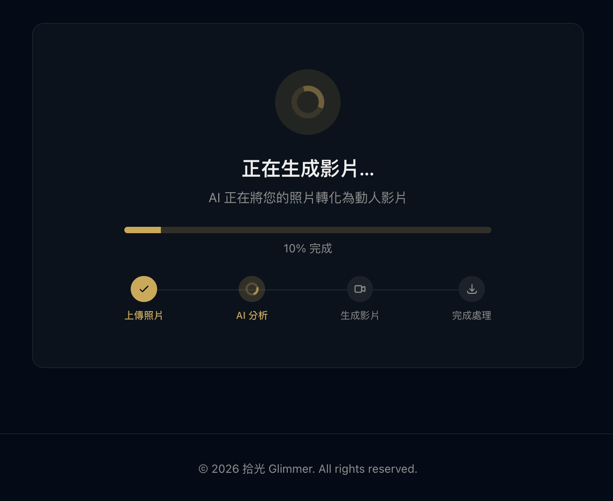
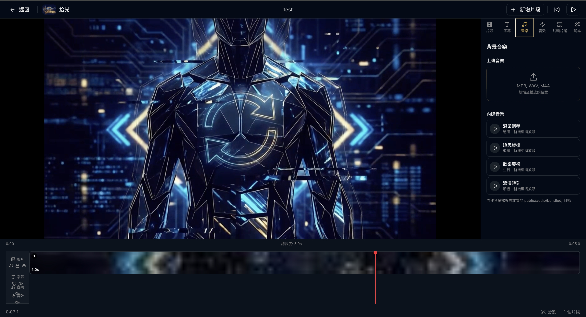

# 拾光 Glimmer

**AI-powered memorial video platform** — Upload a photo, get a cinematic video in minutes.

Built for life's most meaningful moments: memorials, birthdays, weddings, pet tributes. No software to install, no video editing skills required.

**[Try it free at glimmer.video](https://glimmer.video)**


---

## What It Does

1. **Upload** a photo of someone you love
2. **Choose** an occasion (memorial, birthday, wedding, pet tribute)
3. **Generate** — AI creates a cinematic video clip with natural motion
4. **Edit** — Arrange clips on a multi-track timeline, add music, subtitles, title cards
5. **Export** — Render the final MP4 entirely in your browser

No server-side video processing. No uploads of your final video. Everything stays in your browser.

### Occasions


### Create & Generate

| Upload & Configure | AI Generation Progress |
|:---:|:---:|
|  |  |

### Edit & Export



### Gallery


## Key Features

### AI Video Generation
- **Multi-provider** — BytePlus Seedance, Google Veo 3.1, Kling AI
- **Smart prompts** — Category-aware prompt engine (person vs. pet, occasion-specific)
- **Multiple aspect ratios** — 16:9, 9:16, 1:1
- **Batch generation** — Generate multiple clips from a folder of photos via CLI

### Browser-Based Video Editor
- **Multi-track timeline** — Video, subtitle, music, and SFX tracks
- **Drag, trim, split** — Free clip positioning, resize handles, split at playhead
- **Music & SFX** — Bundled tracks + custom upload, positioned on timeline
- **Subtitles** — Text overlays with drag-to-position on preview
- **Title & outro cards** — Customizable intro/outro screens
- **Filters & speed** — Warm, vintage, B&W, vivid presets; 0.5x–2x speed
- **In-browser export** — FFmpeg WASM renders the final MP4 client-side
- **Auto-save** — IndexedDB persistence, survives page reloads

### Platform
- **Edge-native** — Runs on Cloudflare Pages, no server required
- **Pay-per-video** — No subscription; 1 free video per email
- **Taiwan payments** — ECPay integration (credit card, ATM, CVS)
- **Email-only auth** — No passwords, no OAuth, just verify your email

## Architecture

```
Client (Browser)                    Cloudflare Edge
┌──────────────┐                   ┌──────────────────┐
│  Next.js App │ ── poll status ──>│  API Routes      │
│              │                   │  (Edge Runtime)  │
│  FFmpeg WASM │                   │                  │
│  (export)    │                   │  KV: job state   │
└──────────────┘                   │  R2: video files │
                                   └────────┬─────────┘
                                            │
                                   ┌────────▼─────────┐
                                   │  AI Providers     │
                                   │  BytePlus / Veo   │
                                   │  / Kling AI       │
                                   └──────────────────┘
```

**Client-driven polling** — no background workers, no WebSockets. The client polls `/api/status/[id]` which checks the external AI provider on each request and updates KV. Fully compatible with Edge Runtime (no `setTimeout`, no `waitUntil`).

## Tech Stack

| Layer | Technology |
|-------|-----------|
| Framework | Next.js 16, React 19, TypeScript |
| Styling | Tailwind CSS 4, Radix UI, shadcn/ui |
| Hosting | Cloudflare Pages (Edge Runtime) |
| Storage | Cloudflare KV (job state) + R2 (video files) |
| Video Export | FFmpeg WASM (in-browser) |
| AI Video | BytePlus Seedance, Google Veo 3.1, Kling AI |
| Payments | ECPay (Taiwan), Stripe (international) |
| Email | Resend |
| Monitoring | Sentry (Edge-compatible, raw HTTP) |

## Getting Started

### Prerequisites

- Node.js 18+
- API key for at least one video generation provider (BytePlus recommended)

### Setup

```bash
git clone https://github.com/jazzpujols34/glimmer.git
cd glimmer/app

npm install

# Copy env template and fill in your API keys
cp .env.example .env.local

# Start dev server
npm run dev -- --port 3200
```

Open [http://localhost:3200](http://localhost:3200).

> **Note:** Video generation requires valid API keys. Without them, you can explore the UI but not generate videos. KV/R2 storage falls back to in-memory in dev mode.

### Environment Variables

Copy `.env.example` to `.env.local`. Key variables:

| Variable | Description | Required |
|----------|-------------|----------|
| `BYTEPLUS_API_KEY` | BytePlus Seedance API key | Yes (primary provider) |
| `BYTEPLUS_MODEL_ID` | BytePlus model endpoint ID | Yes |
| `GOOGLE_CLOUD_PROJECT_ID` | GCP project for Veo 3.1 | Optional |
| `KLING_ACCESS_KEY` | Kling AI access key | Optional |
| `KLING_SECRET_KEY` | Kling AI secret key | Optional |
| `RESEND_API_KEY` | Email verification | Optional |
| `STRIPE_SECRET_KEY` | Stripe payments | Optional |
| `ECPAY_MERCHANT_ID` | ECPay payments (Taiwan) | Optional |
| `ADMIN_EMAILS` | Comma-separated admin emails | Optional |

See `.env.example` for the full list.

### Commands

```bash
npm run dev -- --port 3200   # Dev server
npm run build                 # Production build (Cloudflare Pages)
npm test                      # Run tests (Vitest, 51 tests)
```

### Batch Video Generation (CLI)

Generate videos from a folder of photos:

```bash
# Always use production — local dev lacks KV/R2
node scripts/batch-generate.mjs /path/to/photos \
  --email your@email.com \
  --base-url https://glimmer.video

# Check status
node scripts/batch-status.mjs --base-url https://glimmer.video
```

Options: `--clips 1-4`, `--model byteplus|veo-3.1|kling-ai`, `--occasion memorial|birthday|wedding|pet|other`, `--dry-run`

## Project Structure

```
app/src/
├── app/                    # Next.js App Router
│   ├── api/                # 34 API routes (all Edge Runtime)
│   │   ├── generate/       # Video generation (POST)
│   │   ├── status/[id]/    # Job polling (GET)
│   │   ├── gallery/        # Gallery listing
│   │   ├── checkout/       # Stripe payment
│   │   └── webhooks/       # ECPay webhook
│   ├── create/             # Upload + generate page
│   ├── edit/[id]/          # Video editor
│   ├── gallery/            # User gallery
│   └── generate/[id]/      # Generation progress
├── components/
│   ├── editor/             # Timeline, music, subtitle panels
│   ├── storyboard/         # Multi-slot storyboard editor
│   └── ui/                 # shadcn/ui primitives
├── lib/                    # Core business logic
│   ├── veo.ts              # Multi-provider video generation
│   ├── credits.ts          # Credit system + admin gating
│   ├── prompts.ts          # Category-aware AI prompt builder
│   ├── ecpay.ts            # ECPay payment (Web Crypto HMAC)
│   ├── storage.ts          # KV/in-memory storage abstraction
│   ├── r2.ts               # R2 video archival
│   └── editor/             # Editor logic (auto-save, ffmpeg, timeline)
└── types/                  # TypeScript type definitions
```

## Deployment

Deployed on **Cloudflare Pages** with auto-deploy on push to `main`.

```bash
cd app && npm run build
```

Built with `@cloudflare/next-on-pages`. Every API route must export `runtime = 'edge'` or the Cloudflare build will fail.

### Edge Runtime Constraints

This app runs entirely on Cloudflare's Edge Runtime — no Node.js APIs:
- No `fs`, `path`, `crypto.createHmac` — uses Web Crypto API instead
- No background tasks — uses client-driven polling + KV
- No heavy SDKs — Stripe/ECPay via raw `fetch()`
- In-memory state not shared across isolates — KV for all persistence

## Business Model

Pay-per-video credits, not subscriptions. Optimized for event-driven usage.

| Plan | Price | Credits |
|------|-------|---------|
| Free | NT$0 | 1 video per email |
| Single | NT$499 | 1 credit |
| 5-Pack | NT$1,999 | 5 credits (NT$400/ea) |
| Enterprise | Contact us | Custom |

## Contributing

Contributions welcome! Please open an issue first to discuss what you'd like to change.

## License

MIT

---

Built with [Claude Code](https://claude.ai/claude-code).
